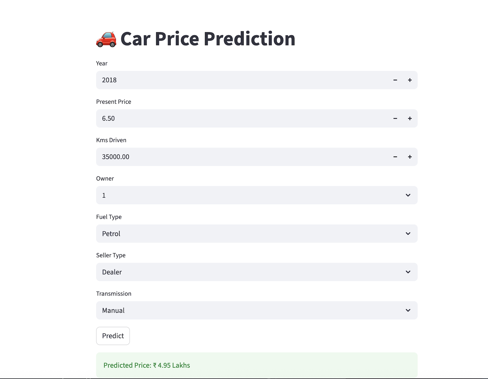

🚗 Car Price Prediction – End-to-End ML Pipeline

A modular Machine Learning pipeline that predicts the selling price of used cars using Scikit-Learn, with a production-style project structure and a Streamlit web application for real-time predictions.

⸻

📌 Project Overview

This project demonstrates a complete ML workflow:
	•	Configuration-driven pipeline (YAML-based)
	•	Modular source structure
	•	Data preprocessing & feature encoding
	•	Model training and evaluation
	•	Logging system
	•	Real-time prediction through a web interface

The objective is to build a clean, scalable ML project structure similar to industry standards.

🏗️ Project Architecture

'''carpriceprd/
│
├── src/
│   ├── config_loader.py      # Load YAML configuration
│   ├── data_loader.py        # Load dataset
│   ├── preprocessing.py      # Feature encoding & transformation
│   ├── train.py              # Model training logic
│   ├── evaluate.py           # Model evaluation (R²)
│   ├── predict.py            # Prediction function
│   └── logger.py             # Logging configuration
│
├── app.py                    # Streamlit Web Application
├── main.py                   # Pipeline entry point
├── config.yaml               # Configuration file
├── car data.csv              # Dataset
├── requirements.txt          # Project dependencies
└── README.md
'''

⚙️ Machine Learning Workflow

1️⃣ Configuration Management

Loads parameters (dataset path, test size, random state) from config.yaml.

2️⃣ Data Loading

Reads dataset using a dedicated module.

3️⃣ Data Preprocessing

Encodes categorical variables:
	•	Fuel_Type
	•	Seller_Type
	•	Transmission

4️⃣ Model Training

Splits data and trains a regression model.

5️⃣ Model Evaluation

Evaluates model performance using:
	•	R² Score

6️⃣ Prediction

Generates price predictions using trained model.

⸻

🌐 Web Application (Streamlit)

The project includes an interactive web interface where users can:
	•	Select fuel type, seller type, transmission
	•	Enter year, kilometers driven, present price, owner count
	•	Get instant predicted car price

📸 Web Application Preview

  

🚀 How to Run the Project

1️⃣ Clone Repository
git clone https://github.com/KishoreKumar477/carpriceprd.git
cd carpriceprd

2️⃣ Create Virtual Environment
python3 -m venv .venv
source .venv/bin/activate

3️⃣ Install Dependencies
pip install -r requirements.txt

4️⃣ Run Training Pipeline
python main.py

5️⃣ Run Web App
streamlit run app.py

 Model Information
	•	Algorithm: Linear Regression
	•	Evaluation Metric: R² Score
	•	Libraries: Pandas, NumPy, Scikit-Learn, Streamlit
